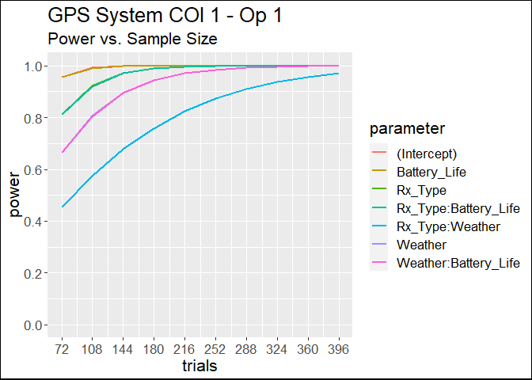
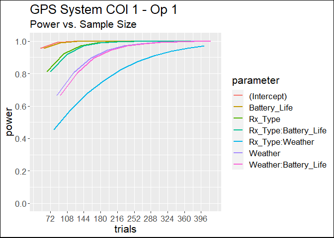
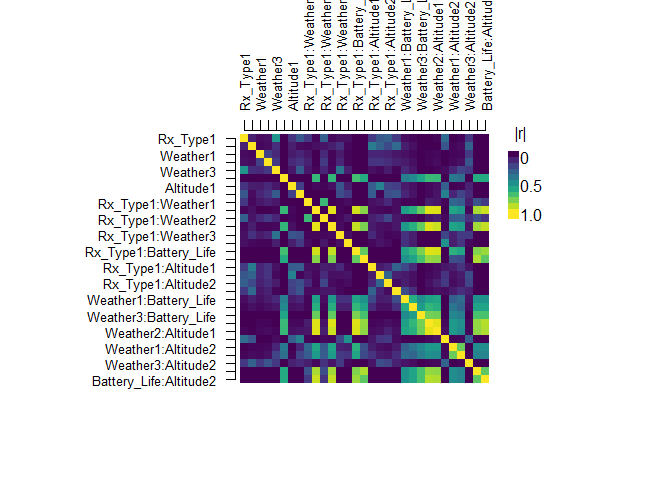
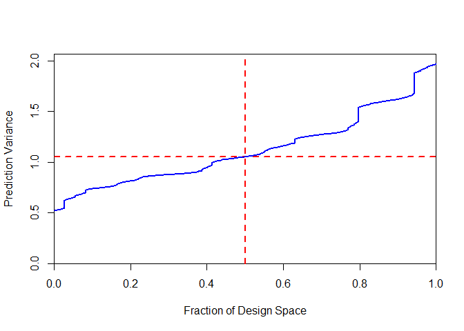
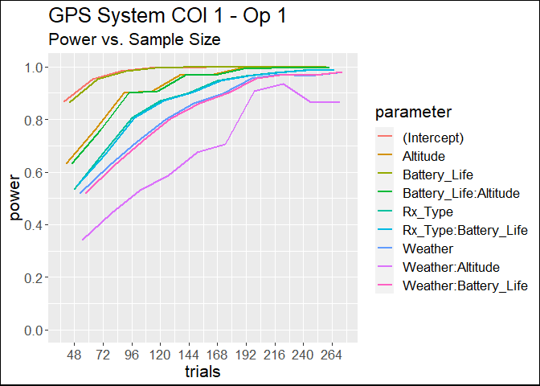
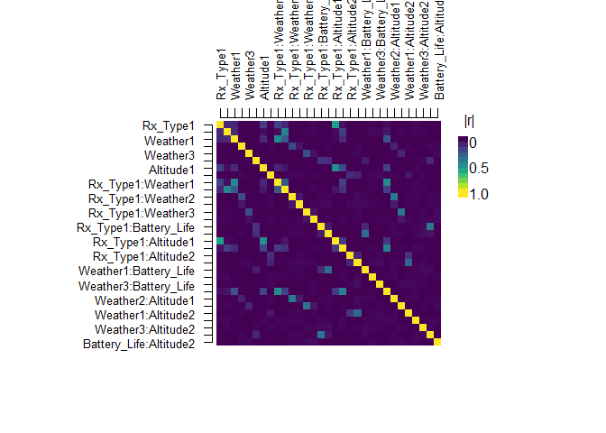
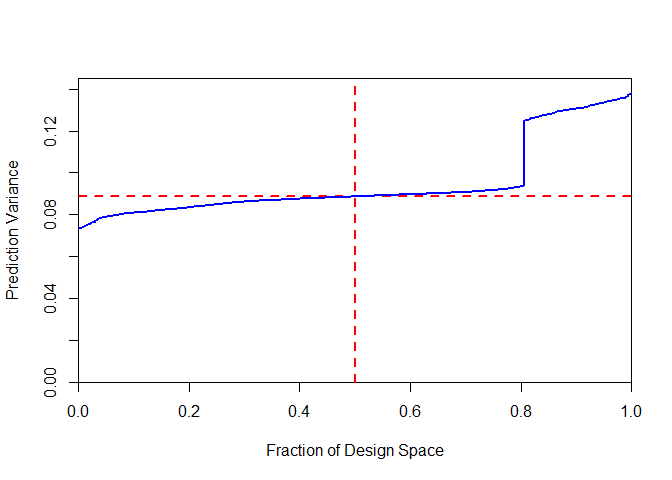
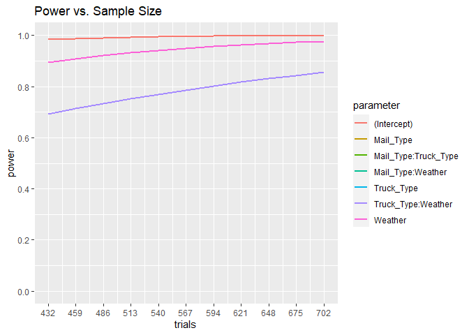
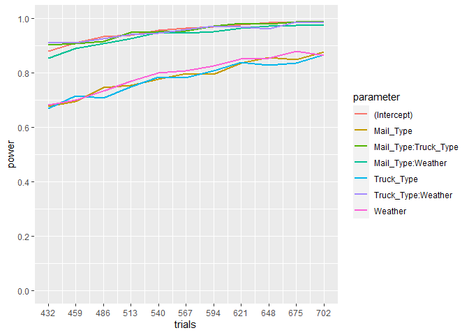
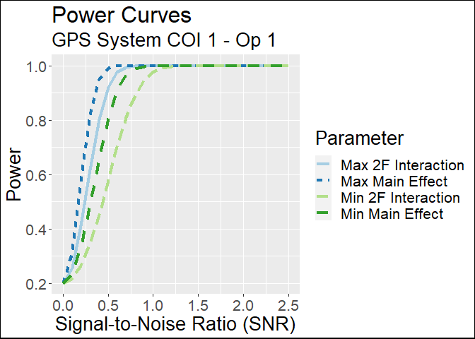

Design of Experiments Using R skpr Guide
================
By: Antony Brown
3/29/2022

## Table of Contents

1.  Background
2.  skpr Features
3.  Environment Setup
4.  Full Factorial Design (Continuous Response)
5.  D-Optimal Design (Continuous Response)
6.  Full Factorial Design (Binary Response)
7.  D-Optimal Design (Binary Response)
8.  Ao Simulation and MTBCF
9.  Power Curve Generation
10. References

## Background

The purpose of this guide is to provide step-by-step instructions on how
to generate and evaluate test designs using the [R package
“skpr.”](https://www.jstatsoft.org/article/download/v099i01/1435 "Optimal Design Generation and Power Evaluation in R: The skpr Package")
While guides exist to show how to perform these actions using a
combination of JMP and the Excel-based Test Design Suite, this method
produces superior results and capabilities all within a single software
platform. R and R Studio are also integrated into the AF Datalab VAULT
construct, which allows for cloud storage and the use of multi-core
computing power.

By using the R skpr package, we can more easily determine the correct
number of replications for our test design, as well as the associated
conservative power estimates. We also gain the ability to use Monte
Carlo simulation methods for designs with non-normal response variables
or blocked designs.

### Conservative Power Estimates

As of JMP 15, the default coefficients for q-level categorical factors
consists of all active coefficients of magnitude = 1, alternating sign
starting with +1. In the case of odd q, the final coefficient is set =
0. These nonzero coefficients all contribute to δ, such that the
majority of the time for factors with more than three levels the factor
effect power greatly exceeds the most conservative power. **In simple
terms, you can end up in a situation where a categorical factor with an
odd number of levels \> q can have a higher power estimation than a
categorical factor with q levels (where q is even), and over-estimating
your effect power.** Therefore it is [recommended by IDA to utilize
conservative power estimations in test
design.](https://apps.dtic.mil/sti/pdfs/ADA619843.pdf "Power Analysis Tutorial for Experimental Design Software")

The conservative approach to be used with categorical factors with more
than two levels mimics the approach used with two-level factors by
assuming that the mean response of one level differs from the another
level, while all the other levels do not contribute to changing the
response mean. If anticipated responses or anticipated coefficients are
reasonably known (past test data of essentially the same system), then
the user can modify the defaults. The minimum power is obtained by
iteratively searching for and finding the pair of factor levels which
yield the lowest power for that factor in the given design.

In skpr, setting conservative = TRUE:

> Specifies whether default method for generating anticipated
> coefficents should be conservative or not. `TRUE` will give the most
> conservative estimate of power by setting all but one (or multiple if
> they are equally low) level in each categorical factor’s anticipated
> coefficients to zero.

## skpr Features

### Computer Generated Designs

1.  D-optimal: Minimizes the joint variance of the parameters in the
    statistical model. D-optimal designs are the best for detecting
    parameter effects and estimating their parameters. For this reason,
    D-optimality is the most often used optimality in OT.

2.  I-optimal: Minimizes the average prediction variance of statistical
    models. I-optimal designs are best for prediction capability and
    will spread the test points throughout the design space. I-optimal
    designs can help “force” a “middle” point into the design.

3.  A-optimal: Minimizes the aliasing between the model effects and
    other alias terms. These designs are more robust to model effects
    that are active but not included in the original design.

4.  G-optimal: Minimizes the maximum variance of the predicted values.

5.  E-optimal: Maximizes the minimum eigenvalue of the information
    matrix.

6.  T-optimal: Maximizes the discrepancy between two proposed models at
    the design locations.

7.  Custom-optimal: User-defined optimality criteria.

### Split-Plot Designs

A common constraint on an experimental design is that one of the factors
is hard-to-change, and thus must be varied less often than the other
factors (Ju and Lucas 2002). In such a design, this “hard-to-change”
factor is kept constant for some number of runs while the “easy-
to-change” factors vary from run to run (Yates 1935; Jones and
Nachtsheim 2009; Goos and Vandebroek 2001; 2003; 2005). This is called a
split-plot design, and a set of runs in which the hard-to-change factor
is held constant is called a whole-plot.

### Monte Carlo Simulation

When designing an experiment with a non-normally distributed response
variable, it can be difficult to calculate power analytically. Often,
power for these designs is estimated by relying on a normal
approximation to the underlying non-normal distribution (Johnson,
Freeman, Simpson, and Anderson 2018). The validity of the normal
approximation can be hard to quantify, and experiments with small sample
sizes are where those approximations are likely to fail, potentially
leading to inaccurate power calculations. In these cases, the best way
to estimate the power is by simulating the experiment and calculating
the power values via a Monte Carlo simulation.

### Plotting

skpr provides two built-in plotting functions:

1.  plot_fds: Fraction of design space plot.

2.  plot_correlation: Correlation map plot.

### GUI

For quick test designs, you can use the built-in GUI if you don’t want
to work with code. An adaptation using R Shiny can be found
[here](https://stricje1.shinyapps.io/doer/).

### Other Features

Please see [the skpr
documentation](https://www.jstatsoft.org/article/download/v099i01/1435 "Optimal Design Generation and Power Evaluation in R: The skpr Package")
for more information on all of the skpr features listed here, and more.

## Environment Setup

Install and import the following libraries:

``` r
library(skpr)
library(mbest)
library(ggplot2)
library(pwr)
library(tidyverse)
library(readr)
```

Set a random seed for reproducibility:

``` r
set.seed(4)
```

## Example: Full Factorial Design (Continuous Response)

Suppose we want to measure the accuracy of a new GPS receiver. We have
the following:

| COI                                                     | Operation                                  | Mission Effect (response variable) |
|:--------------------------------------------------------|:-------------------------------------------|:-----------------------------------|
| COI 1: Does the GPS system support tactical operations? | Operation 1: Accurate location information | Location inaccuracy (meters)       |

With the associated factors and levels table:

| Rx_Type    | Weather | Battery_Life |
|:-----------|:--------|:-------------|
| Handheld   | Clear   | 100          |
| Airborne   | Cloudy  | 80           |
| Fixed_Site | Rain    | 50           |
| \-         | Snow    | \-           |

Our first step is to generate all combinations of input factors, using
“as.factor” for non-numerical factors:

``` r
factorial = expand.grid(Rx_Type = as.factor(c("Handheld", "Airborne", "Fixed_Site")), Weather = as.factor(c("Clear", "Cloudy", "Precipitation", "Snow")), Battery_Life = c(50, 80, 100))

factorial
```

    ##       Rx_Type       Weather Battery_Life
    ## 1    Handheld         Clear           50
    ## 2    Airborne         Clear           50
    ## 3  Fixed_Site         Clear           50
    ## 4    Handheld        Cloudy           50
    ## 5    Airborne        Cloudy           50
    ## 6  Fixed_Site        Cloudy           50
    ## 7    Handheld Precipitation           50
    ## 8    Airborne Precipitation           50
    ## 9  Fixed_Site Precipitation           50
    ## 10   Handheld          Snow           50
    ## 11   Airborne          Snow           50
    ## 12 Fixed_Site          Snow           50
    ## 13   Handheld         Clear           80
    ## 14   Airborne         Clear           80
    ## 15 Fixed_Site         Clear           80
    ## 16   Handheld        Cloudy           80
    ## 17   Airborne        Cloudy           80
    ## 18 Fixed_Site        Cloudy           80
    ## 19   Handheld Precipitation           80
    ## 20   Airborne Precipitation           80
    ## 21 Fixed_Site Precipitation           80
    ## 22   Handheld          Snow           80
    ## 23   Airborne          Snow           80
    ## 24 Fixed_Site          Snow           80
    ## 25   Handheld         Clear          100
    ## 26   Airborne         Clear          100
    ## 27 Fixed_Site         Clear          100
    ## 28   Handheld        Cloudy          100
    ## 29   Airborne        Cloudy          100
    ## 30 Fixed_Site        Cloudy          100
    ## 31   Handheld Precipitation          100
    ## 32   Airborne Precipitation          100
    ## 33 Fixed_Site Precipitation          100
    ## 34   Handheld          Snow          100
    ## 35   Airborne          Snow          100
    ## 36 Fixed_Site          Snow          100

Now, we generate our design. We want all main effects plus all two-level
interactions. For this example, a full factorial design needs 3x4x3 = 36
runs:

``` r
optdesign = gen_design(candidateset = factorial, model = ~ (Rx_Type + Weather + Battery_Life)^2, trials = 36)
```

Let’s evaluate our design using conservative power estimates. In JMP, we
would need to manually set the anticipated coefficients for each
parameter in order to achieve a conservative power reading. skpr does
this automatically for us. We also set our alpha level and anticipated
effect size (SNR, or Signal to Noise Ratio) in this function.

> Effect Size: Default `2`. The signal-to-noise ratio. For continuous
> factors, this specifies the difference in response between the highest
> and lowest levels of the factor (which are -1 and +1 after eval_design
> normalizes the input data), assuming that the root mean square error
> is 1. If you do not specify anticoef, the anticipated coefficients
> will be half of effectsize. If you do specify anticoef, effectsize
> will be ignored.)

If we don’t have any prior information to inform our SNR, we can opt to
use \[the DOT&E standard SNR of 1.5,\]
[4](https://www.afit.edu/STAT/passthru.cfm?statfile=109 "Understanding the Signal to Noise Ratio in Design of Experiments")
with alpha = 0.2. For this example, let’s assume that we are looking to
for a difference to detect in accuracy of 0.5 meters, and from
historical data we believe our standard deviation is 0.7 meters. Our SNR
is 0.5/0.7 = 0.7143, and we then evaluate our design as follows:

``` r
eval_design(design = optdesign, alpha = 0.2, effectsize = 0.7143, detailedoutput = TRUE, conservative = TRUE)
```

    ##                parameter            type     power anticoef alpha trials
    ## 1            (Intercept)    effect.power 0.7617989       NA   0.2     36
    ## 2                Rx_Type    effect.power 0.5410361       NA   0.2     36
    ## 3                Weather    effect.power 0.4405879       NA   0.2     36
    ## 4           Battery_Life    effect.power 0.7560564       NA   0.2     36
    ## 5        Rx_Type:Weather    effect.power 0.3043804       NA   0.2     36
    ## 6   Rx_Type:Battery_Life    effect.power 0.5410361       NA   0.2     36
    ## 7   Weather:Battery_Life    effect.power 0.4215510       NA   0.2     36
    ## 8            (Intercept) parameter.power 0.7617989  0.35715   0.2     36
    ## 9               Rx_Type1 parameter.power 0.5516284  0.35715   0.2     36
    ## 10              Rx_Type2 parameter.power 0.5516284 -0.35715   0.2     36
    ## 11              Weather1 parameter.power 0.2000000  0.00000   0.2     36
    ## 12              Weather2 parameter.power 0.2000000  0.00000   0.2     36
    ## 13              Weather3 parameter.power 0.4695923  0.35715   0.2     36
    ## 14          Battery_Life parameter.power 0.7560564  0.35715   0.2     36
    ## 15     Rx_Type1:Weather1 parameter.power 0.3378022  0.35715   0.2     36
    ## 16     Rx_Type2:Weather1 parameter.power 0.2000000  0.00000   0.2     36
    ## 17     Rx_Type1:Weather2 parameter.power 0.3378022 -0.35715   0.2     36
    ## 18     Rx_Type2:Weather2 parameter.power 0.2000000  0.00000   0.2     36
    ## 19     Rx_Type1:Weather3 parameter.power 0.2000000  0.00000   0.2     36
    ## 20     Rx_Type2:Weather3 parameter.power 0.2000000  0.00000   0.2     36
    ## 21 Rx_Type1:Battery_Life parameter.power 0.5491228  0.35715   0.2     36
    ## 22 Rx_Type2:Battery_Life parameter.power 0.5491228 -0.35715   0.2     36
    ## 23 Weather1:Battery_Life parameter.power 0.4512915  0.35715   0.2     36
    ## 24 Weather2:Battery_Life parameter.power 0.4512915 -0.35715   0.2     36
    ## 25 Weather3:Battery_Life parameter.power 0.2000000  0.00000   0.2     36
    ## ============================Evaluation Info=============================
    ## • Alpha = 0.2 • Trials = 36 • Blocked = FALSE
    ## • Evaluating Model = ~Rx_Type + Weather + Battery_Life + Rx_Type:Weather + Rx_Type:Battery_Life + Weather:Battery_Life
    ## • Anticipated Coefficients = c(0.357, 0.357, -0.357, 0.000, 0.000, 0.357, 0.357, 0.357, 0.000, -0.357, 0.000, 0.000, 0.000, 0.357, -0.357, 0.357, -0.357, 0.000)

We see that all of our *effect power values* are below the standard 0.8
that we need for our test. We need to increase the number of replicates
in our design, but how many do we need? In JMP, we would have to
manually increase the number of replicates until we reached our desired
power levels. with skpr, we can do this automatically. Let’s say that we
believe the “optimal” number of replicates may be between 2 and 11.

Note: You can edit the code below by multiplying your original design by
the number of replicates you want. So for our example, we have an
original design with 36 trials. Adding 1 replicate of that design would
make for a total of 72 trials, and likewise adding 10 replicates would
make a total of 396 trials. The “by” portion of the code sets the size
of iteration (set this to your original number of trials).

``` r
counter <-1
designpower <-list()
for(samplesize in seq(72, 396, by = 36)) {
  optdesign <- gen_design(candidateset = factorial, model = ~ (Rx_Type + Weather + Battery_Life)^2, trials = samplesize)
  designpower[[counter]] <- eval_design(design = optdesign, alpha = 0.2, effectsize = 0.7143, detailedoutput = TRUE, conservative = TRUE)
  counter <- counter + 1
}

designpower[[length(designpower)]]
```

    ##                parameter            type     power anticoef alpha trials
    ## 1            (Intercept)    effect.power 1.0000000       NA   0.2    396
    ## 2                Rx_Type    effect.power 0.9999830       NA   0.2    396
    ## 3                Weather    effect.power 0.9991964       NA   0.2    396
    ## 4           Battery_Life    effect.power 1.0000000       NA   0.2    396
    ## 5        Rx_Type:Weather    effect.power 0.9703181       NA   0.2    396
    ## 6   Rx_Type:Battery_Life    effect.power 0.9999829       NA   0.2    396
    ## 7   Weather:Battery_Life    effect.power 0.9991964       NA   0.2    396
    ## 8            (Intercept) parameter.power 1.0000000  0.35715   0.2    396
    ## 9               Rx_Type1 parameter.power 0.9999072  0.35715   0.2    396
    ## 10              Rx_Type2 parameter.power 0.9999072 -0.35715   0.2    396
    ## 11              Weather1 parameter.power 0.2000000  0.00000   0.2    396
    ## 12              Weather2 parameter.power 0.9975653  0.35715   0.2    396
    ## 13              Weather3 parameter.power 0.9975653 -0.35715   0.2    396
    ## 14          Battery_Life parameter.power 1.0000000  0.35715   0.2    396
    ## 15     Rx_Type1:Weather1 parameter.power 0.2000000  0.00000   0.2    396
    ## 16     Rx_Type2:Weather1 parameter.power 0.2000000  0.00000   0.2    396
    ## 17     Rx_Type1:Weather2 parameter.power 0.9469532  0.35715   0.2    396
    ## 18     Rx_Type2:Weather2 parameter.power 0.9469532 -0.35715   0.2    396
    ## 19     Rx_Type1:Weather3 parameter.power 0.2000000  0.00000   0.2    396
    ## 20     Rx_Type2:Weather3 parameter.power 0.2000000  0.00000   0.2    396
    ## 21 Rx_Type1:Battery_Life parameter.power 0.9999066  0.35715   0.2    396
    ## 22 Rx_Type2:Battery_Life parameter.power 0.9999066 -0.35715   0.2    396
    ## 23 Weather1:Battery_Life parameter.power 0.9975645  0.35715   0.2    396
    ## 24 Weather2:Battery_Life parameter.power 0.9975645 -0.35715   0.2    396
    ## 25 Weather3:Battery_Life parameter.power 0.2000000  0.00000   0.2    396
    ## ============================Evaluation Info=============================
    ## • Alpha = 0.2 • Trials = 396 • Blocked = FALSE
    ## • Evaluating Model = ~Rx_Type + Weather + Battery_Life + Rx_Type:Weather + Rx_Type:Battery_Life + Weather:Battery_Life
    ## • Anticipated Coefficients = c(0.357, 0.357, -0.357, 0.000, 0.357, -0.357, 0.357, 0.000, 0.000, 0.357, -0.357, 0.000, 0.000, 0.357, -0.357, 0.357, -0.357, 0.000)

The results with the max number of replicates is shown for you, but
let’s visualize all of our results.

Note: Set your x scale to match the iterations that you performed above.

``` r
joined <- do.call(rbind, designpower)
filtered <- dplyr::filter(joined, type == "effect.power")

ggplot(filtered) + ggtitle("Power vs. Sample Size")+

  theme(text = element_text(size = 16))+

  theme(plot.background = element_rect(color = "black", size = 1))+

  labs(title = "GPS System COI 1 - Op 1")+
  labs(subtitle = "Power vs. Sample Size")+

  geom_line(aes(x = trials, y = power, color = parameter), size = 1) +
  
  scale_y_continuous(limits = c(0, 1), breaks = seq(0, 1, 0.2)) +

  scale_x_continuous(breaks = seq(72, 396, 36))
```

<!-- -->

Some of our lines are overlapping, which may be confusing for the
viewer. Let’s add some spacing with the position_dodge setting to ensure
that we can see all of our parameters:

``` r
joined <- do.call(rbind, designpower)
filtered <- dplyr::filter(joined, type == "effect.power")

ggplot(filtered) + ggtitle("Power vs. Sample Size")+

  theme(text = element_text(size = 16))+

  theme(plot.background = element_rect(color = "black", size = 1))+

  labs(title = "GPS System COI 1 - Op 1")+
  labs(subtitle = "Power vs. Sample Size")+

  geom_line(aes(x = trials, y = power, color = parameter), size = 1, position = position_dodge(50)) +
  
  scale_y_continuous(limits = c(0, 1), breaks = seq(0, 1, 0.2)) +

  scale_x_continuous(breaks = seq(72, 396, 36))
```

    ## Warning: position_dodge requires non-overlapping x intervals

<!-- -->

From the above output, we can see that we’ll need at least 216 samples
(or 6 replicates of our original 36 run full factorial design) to reach
at least 0.8 power for all of our main effects and effect interactions
(some of our effect estimates are not seen because they are on the exact
same line as others). Let’s evaluate this “ideal” design:

``` r
end_design = gen_design(candidateset = factorial, model = ~ (Rx_Type + Weather + Battery_Life)^2, trials = 216)
eval_design(design = end_design, alpha = 0.2, effectsize = 0.7143, detailedoutput = TRUE, conservative = TRUE)
```

    ##                parameter            type     power anticoef alpha trials
    ## 1            (Intercept)    effect.power 0.9999620       NA   0.2    216
    ## 2                Rx_Type    effect.power 0.9960209       NA   0.2    216
    ## 3                Weather    effect.power 0.9709257       NA   0.2    216
    ## 4           Battery_Life    effect.power 0.9999620       NA   0.2    216
    ## 5        Rx_Type:Weather    effect.power 0.8240387       NA   0.2    216
    ## 6   Rx_Type:Battery_Life    effect.power 0.9960209       NA   0.2    216
    ## 7   Weather:Battery_Life    effect.power 0.9709257       NA   0.2    216
    ## 8            (Intercept) parameter.power 0.9999620  0.35715   0.2    216
    ## 9               Rx_Type1 parameter.power 0.9922898  0.35715   0.2    216
    ## 10              Rx_Type2 parameter.power 0.9922898 -0.35715   0.2    216
    ## 11              Weather1 parameter.power 0.9593122  0.35715   0.2    216
    ## 12              Weather2 parameter.power 0.9593122 -0.35715   0.2    216
    ## 13              Weather3 parameter.power 0.2000000  0.00000   0.2    216
    ## 14          Battery_Life parameter.power 0.9999620  0.35715   0.2    216
    ## 15     Rx_Type1:Weather1 parameter.power 0.8045620  0.35715   0.2    216
    ## 16     Rx_Type2:Weather1 parameter.power 0.8045620 -0.35715   0.2    216
    ## 17     Rx_Type1:Weather2 parameter.power 0.2000000  0.00000   0.2    216
    ## 18     Rx_Type2:Weather2 parameter.power 0.2000000  0.00000   0.2    216
    ## 19     Rx_Type1:Weather3 parameter.power 0.2000000  0.00000   0.2    216
    ## 20     Rx_Type2:Weather3 parameter.power 0.2000000  0.00000   0.2    216
    ## 21 Rx_Type1:Battery_Life parameter.power 0.9922898  0.35715   0.2    216
    ## 22 Rx_Type2:Battery_Life parameter.power 0.9922898 -0.35715   0.2    216
    ## 23 Weather1:Battery_Life parameter.power 0.9593122  0.35715   0.2    216
    ## 24 Weather2:Battery_Life parameter.power 0.9593122 -0.35715   0.2    216
    ## 25 Weather3:Battery_Life parameter.power 0.2000000  0.00000   0.2    216
    ## ============================Evaluation Info=============================
    ## • Alpha = 0.2 • Trials = 216 • Blocked = FALSE
    ## • Evaluating Model = ~Rx_Type + Weather + Battery_Life + Rx_Type:Weather + Rx_Type:Battery_Life + Weather:Battery_Life
    ## • Anticipated Coefficients = c(0.357, 0.357, -0.357, 0.357, -0.357, 0.000, 0.357, 0.357, -0.357, 0.000, 0.000, 0.000, 0.000, 0.357, -0.357, 0.357, -0.357, 0.000)

We’ll now produce and download our final test run list:

``` r
end_design
```

    ##        Rx_Type       Weather Battery_Life
    ## 1     Airborne          Snow           50
    ## 2     Airborne         Clear           50
    ## 3     Airborne          Snow           50
    ## 4     Airborne         Clear           50
    ## 5     Airborne          Snow           50
    ## 6     Airborne         Clear           50
    ## 7     Airborne         Clear          100
    ## 8     Airborne          Snow           50
    ## 9   Fixed_Site         Clear          100
    ## 10    Airborne         Clear           50
    ## 11    Airborne         Clear          100
    ## 12  Fixed_Site        Cloudy          100
    ## 13  Fixed_Site         Clear          100
    ## 14    Handheld         Clear          100
    ## 15    Handheld Precipitation          100
    ## 16    Airborne         Clear          100
    ## 17  Fixed_Site        Cloudy          100
    ## 18    Airborne         Clear           50
    ## 19    Handheld          Snow          100
    ## 20    Airborne        Cloudy          100
    ## 21    Airborne          Snow           50
    ## 22    Airborne Precipitation          100
    ## 23  Fixed_Site         Clear           50
    ## 24    Airborne Precipitation          100
    ## 25    Airborne        Cloudy          100
    ## 26    Handheld Precipitation          100
    ## 27    Airborne Precipitation           50
    ## 28    Airborne          Snow           50
    ## 29  Fixed_Site         Clear           50
    ## 30  Fixed_Site         Clear          100
    ## 31    Airborne          Snow          100
    ## 32    Handheld         Clear          100
    ## 33    Handheld         Clear           50
    ## 34  Fixed_Site          Snow           50
    ## 35    Airborne         Clear          100
    ## 36  Fixed_Site        Cloudy          100
    ## 37    Airborne Precipitation          100
    ## 38    Airborne          Snow           50
    ## 39    Handheld         Clear           50
    ## 40    Handheld Precipitation          100
    ## 41    Handheld          Snow           50
    ## 42    Handheld         Clear           50
    ## 43    Handheld         Clear          100
    ## 44    Handheld          Snow          100
    ## 45    Airborne         Clear           50
    ## 46  Fixed_Site          Snow           50
    ## 47    Airborne Precipitation          100
    ## 48    Airborne Precipitation           50
    ## 49  Fixed_Site        Cloudy           50
    ## 50    Airborne          Snow          100
    ## 51  Fixed_Site          Snow           50
    ## 52    Handheld         Clear           50
    ## 53    Handheld        Cloudy           50
    ## 54  Fixed_Site        Cloudy          100
    ## 55    Airborne         Clear           50
    ## 56  Fixed_Site Precipitation           50
    ## 57  Fixed_Site Precipitation          100
    ## 58    Handheld          Snow          100
    ## 59    Handheld        Cloudy          100
    ## 60    Handheld Precipitation           50
    ## 61    Handheld        Cloudy          100
    ## 62    Handheld        Cloudy          100
    ## 63  Fixed_Site         Clear           50
    ## 64    Handheld        Cloudy           50
    ## 65  Fixed_Site         Clear           50
    ## 66    Airborne        Cloudy          100
    ## 67    Airborne        Cloudy          100
    ## 68    Airborne          Snow          100
    ## 69  Fixed_Site          Snow           50
    ## 70    Handheld        Cloudy           50
    ## 71    Handheld Precipitation           50
    ## 72    Handheld        Cloudy          100
    ## 73    Handheld          Snow           50
    ## 74  Fixed_Site Precipitation           50
    ## 75  Fixed_Site          Snow           50
    ## 76  Fixed_Site          Snow          100
    ## 77  Fixed_Site Precipitation          100
    ## 78  Fixed_Site         Clear          100
    ## 79  Fixed_Site          Snow          100
    ## 80    Airborne         Clear          100
    ## 81  Fixed_Site         Clear          100
    ## 82    Airborne Precipitation           50
    ## 83    Handheld        Cloudy           50
    ## 84    Handheld        Cloudy          100
    ## 85    Handheld        Cloudy          100
    ## 86    Handheld         Clear          100
    ## 87  Fixed_Site          Snow          100
    ## 88  Fixed_Site Precipitation           50
    ## 89    Handheld Precipitation          100
    ## 90    Handheld         Clear           50
    ## 91    Airborne Precipitation          100
    ## 92    Handheld Precipitation           50
    ## 93    Airborne Precipitation          100
    ## 94    Handheld         Clear           50
    ## 95  Fixed_Site          Snow           50
    ## 96  Fixed_Site         Clear          100
    ## 97  Fixed_Site        Cloudy          100
    ## 98    Handheld          Snow          100
    ## 99  Fixed_Site        Cloudy           50
    ## 100 Fixed_Site         Clear           50
    ## 101   Airborne          Snow          100
    ## 102   Airborne         Clear          100
    ## 103   Airborne        Cloudy           50
    ## 104   Airborne        Cloudy           50
    ## 105   Handheld Precipitation          100
    ## 106   Handheld Precipitation          100
    ## 107 Fixed_Site Precipitation          100
    ## 108   Handheld         Clear          100
    ## 109   Airborne        Cloudy           50
    ## 110 Fixed_Site Precipitation           50
    ## 111 Fixed_Site        Cloudy          100
    ## 112 Fixed_Site        Cloudy           50
    ## 113   Airborne          Snow           50
    ## 114   Airborne Precipitation           50
    ## 115 Fixed_Site Precipitation          100
    ## 116 Fixed_Site Precipitation           50
    ## 117   Handheld Precipitation           50
    ## 118   Handheld          Snow          100
    ## 119   Airborne        Cloudy          100
    ## 120   Handheld          Snow           50
    ## 121   Handheld         Clear           50
    ## 122   Handheld Precipitation           50
    ## 123   Handheld Precipitation          100
    ## 124 Fixed_Site Precipitation          100
    ## 125   Airborne        Cloudy          100
    ## 126 Fixed_Site          Snow          100
    ## 127   Handheld         Clear          100
    ## 128   Handheld          Snow           50
    ## 129   Handheld         Clear          100
    ## 130   Handheld Precipitation          100
    ## 131   Handheld         Clear           50
    ## 132 Fixed_Site        Cloudy           50
    ## 133   Airborne Precipitation           50
    ## 134   Handheld          Snow           50
    ## 135   Airborne        Cloudy           50
    ## 136   Handheld          Snow           50
    ## 137 Fixed_Site          Snow          100
    ## 138   Airborne          Snow          100
    ## 139   Handheld Precipitation           50
    ## 140   Handheld         Clear          100
    ## 141 Fixed_Site          Snow           50
    ## 142 Fixed_Site         Clear           50
    ## 143 Fixed_Site Precipitation          100
    ## 144   Airborne Precipitation          100
    ## 145 Fixed_Site Precipitation           50
    ## 146   Airborne          Snow          100
    ## 147   Handheld          Snow           50
    ## 148 Fixed_Site        Cloudy          100
    ## 149   Handheld        Cloudy           50
    ## 150 Fixed_Site          Snow           50
    ## 151 Fixed_Site         Clear          100
    ## 152   Airborne Precipitation           50
    ## 153   Airborne          Snow          100
    ## 154 Fixed_Site Precipitation           50
    ## 155   Handheld         Clear           50
    ## 156   Handheld        Cloudy           50
    ## 157   Handheld Precipitation           50
    ## 158   Airborne         Clear           50
    ## 159   Airborne         Clear          100
    ## 160   Handheld          Snow          100
    ## 161 Fixed_Site Precipitation           50
    ## 162   Handheld Precipitation           50
    ## 163   Airborne          Snow           50
    ## 164   Airborne Precipitation           50
    ## 165   Airborne Precipitation           50
    ## 166 Fixed_Site        Cloudy           50
    ## 167   Handheld          Snow           50
    ## 168 Fixed_Site         Clear           50
    ## 169 Fixed_Site Precipitation          100
    ## 170   Airborne Precipitation           50
    ## 171   Airborne         Clear          100
    ## 172 Fixed_Site          Snow          100
    ## 173 Fixed_Site        Cloudy           50
    ## 174 Fixed_Site        Cloudy           50
    ## 175   Airborne         Clear           50
    ## 176 Fixed_Site        Cloudy          100
    ## 177   Airborne          Snow          100
    ## 178   Airborne Precipitation          100
    ## 179   Handheld        Cloudy          100
    ## 180   Handheld          Snow           50
    ## 181   Handheld          Snow          100
    ## 182 Fixed_Site          Snow          100
    ## 183   Airborne        Cloudy          100
    ## 184   Handheld         Clear          100
    ## 185   Handheld        Cloudy           50
    ## 186   Airborne Precipitation          100
    ## 187   Airborne        Cloudy           50
    ## 188 Fixed_Site Precipitation          100
    ## 189   Handheld        Cloudy           50
    ## 190   Handheld        Cloudy           50
    ## 191   Handheld          Snow          100
    ## 192 Fixed_Site         Clear           50
    ## 193   Handheld Precipitation           50
    ## 194 Fixed_Site          Snow           50
    ## 195   Handheld          Snow          100
    ## 196   Handheld Precipitation          100
    ## 197 Fixed_Site         Clear           50
    ## 198 Fixed_Site          Snow          100
    ## 199   Airborne         Clear          100
    ## 200   Handheld        Cloudy          100
    ## 201 Fixed_Site        Cloudy           50
    ## 202   Handheld        Cloudy          100
    ## 203 Fixed_Site         Clear          100
    ## 204 Fixed_Site         Clear          100
    ## 205 Fixed_Site Precipitation           50
    ## 206   Airborne        Cloudy          100
    ## 207 Fixed_Site        Cloudy          100
    ## 208   Airborne          Snow          100
    ## 209   Airborne        Cloudy           50
    ## 210   Airborne        Cloudy           50
    ## 211   Airborne        Cloudy           50
    ## 212 Fixed_Site Precipitation          100
    ## 213   Airborne        Cloudy           50
    ## 214 Fixed_Site        Cloudy           50
    ## 215   Airborne        Cloudy          100
    ## 216 Fixed_Site          Snow          100

## Example: D-Optimal Design (Continuous Response)

Using a similar example from above, we’ll now look at how to create and
evaluate a D-Optimal design. We have a new GPS Rx type and a new factor
of “Altitude.” Our factors and levels table is now the following:

| Rx_Type    | Weather | Battery_Life | Altitude |
|:-----------|:--------|:-------------|:---------|
| Handheld   | Clear   | 100          | High     |
| Airborne   | Cloudy  | 80           | Medium   |
| Fixed_Site | Rain    | \-           | Low      |
| \-         | Snow    | \-           | \-       |

This time, we have the following disallowed combinations:

-   Rx_Type Handheld cannot be tested with High Altitude.
-   Rx_Type Airborne cannot be tested with Snow.

First, we’ll generate the Full Factorial design as before:

``` r
factorial2 = expand.grid(Rx_Type = as.factor(c("Handheld", "Airborne", "Fixed_Site")), Weather = as.factor(c("Clear", "Cloudy", "Precipitation", "Snow")), Battery_Life = c(80, 100), Altitude = as.factor(c("High", "Medium", "Low")))
```

Remove disallowed combinations:

``` r
factorial2 = subset(factorial2, 
                    !(Rx_Type %in% c("Handheld") & Altitude %in% c("High")) &
                    !(Rx_Type %in% c("Airborne") & Weather %in% c("Snow")))

factorial2
```

    ##       Rx_Type       Weather Battery_Life Altitude
    ## 2    Airborne         Clear           80     High
    ## 3  Fixed_Site         Clear           80     High
    ## 5    Airborne        Cloudy           80     High
    ## 6  Fixed_Site        Cloudy           80     High
    ## 8    Airborne Precipitation           80     High
    ## 9  Fixed_Site Precipitation           80     High
    ## 12 Fixed_Site          Snow           80     High
    ## 14   Airborne         Clear          100     High
    ## 15 Fixed_Site         Clear          100     High
    ## 17   Airborne        Cloudy          100     High
    ## 18 Fixed_Site        Cloudy          100     High
    ## 20   Airborne Precipitation          100     High
    ## 21 Fixed_Site Precipitation          100     High
    ## 24 Fixed_Site          Snow          100     High
    ## 25   Handheld         Clear           80   Medium
    ## 26   Airborne         Clear           80   Medium
    ## 27 Fixed_Site         Clear           80   Medium
    ## 28   Handheld        Cloudy           80   Medium
    ## 29   Airborne        Cloudy           80   Medium
    ## 30 Fixed_Site        Cloudy           80   Medium
    ## 31   Handheld Precipitation           80   Medium
    ## 32   Airborne Precipitation           80   Medium
    ## 33 Fixed_Site Precipitation           80   Medium
    ## 34   Handheld          Snow           80   Medium
    ## 36 Fixed_Site          Snow           80   Medium
    ## 37   Handheld         Clear          100   Medium
    ## 38   Airborne         Clear          100   Medium
    ## 39 Fixed_Site         Clear          100   Medium
    ## 40   Handheld        Cloudy          100   Medium
    ## 41   Airborne        Cloudy          100   Medium
    ## 42 Fixed_Site        Cloudy          100   Medium
    ## 43   Handheld Precipitation          100   Medium
    ## 44   Airborne Precipitation          100   Medium
    ## 45 Fixed_Site Precipitation          100   Medium
    ## 46   Handheld          Snow          100   Medium
    ## 48 Fixed_Site          Snow          100   Medium
    ## 49   Handheld         Clear           80      Low
    ## 50   Airborne         Clear           80      Low
    ## 51 Fixed_Site         Clear           80      Low
    ## 52   Handheld        Cloudy           80      Low
    ## 53   Airborne        Cloudy           80      Low
    ## 54 Fixed_Site        Cloudy           80      Low
    ## 55   Handheld Precipitation           80      Low
    ## 56   Airborne Precipitation           80      Low
    ## 57 Fixed_Site Precipitation           80      Low
    ## 58   Handheld          Snow           80      Low
    ## 60 Fixed_Site          Snow           80      Low
    ## 61   Handheld         Clear          100      Low
    ## 62   Airborne         Clear          100      Low
    ## 63 Fixed_Site         Clear          100      Low
    ## 64   Handheld        Cloudy          100      Low
    ## 65   Airborne        Cloudy          100      Low
    ## 66 Fixed_Site        Cloudy          100      Low
    ## 67   Handheld Precipitation          100      Low
    ## 68   Airborne Precipitation          100      Low
    ## 69 Fixed_Site Precipitation          100      Low
    ## 70   Handheld          Snow          100      Low
    ## 72 Fixed_Site          Snow          100      Low

This time, when generating our design, we will not include the 2-factor
combinations that aren’t possible based upon our disallowed combinations
set above. So for this example, we will not include Rx_Type:Altitude or
Rx_Type:Weather. A good starting point for the number of trials in a
D-Optimal design is:

 + 2((\text{number of total categorical factor levels}) -1).")

If this proves to be too few runs to create a design, increase your
number of trials until you’ve reached the minimum. Here, we have:

 + 2(12-1) = 24.")

Generating our design:

``` r
d_optdesign = gen_design(candidateset = factorial2, model = ~ Rx_Type + Weather + Battery_Life + Altitude + Rx_Type:Battery_Life + Weather:Battery_Life + Weather:Altitude + Battery_Life:Altitude, trials = 24, optimality = "D", parallel  = TRUE)
```

See our design:

``` r
d_optdesign
```

    ##       Rx_Type       Weather Battery_Life Altitude
    ## 1    Airborne         Clear          100      Low
    ## 2    Airborne Precipitation          100   Medium
    ## 3  Fixed_Site Precipitation          100     High
    ## 4  Fixed_Site        Cloudy           80     High
    ## 5    Handheld          Snow          100   Medium
    ## 6    Handheld        Cloudy           80   Medium
    ## 7    Handheld         Clear          100   Medium
    ## 8    Airborne        Cloudy          100     High
    ## 9  Fixed_Site        Cloudy          100   Medium
    ## 10 Fixed_Site          Snow           80      Low
    ## 11   Handheld         Clear           80      Low
    ## 12   Handheld        Cloudy          100      Low
    ## 13 Fixed_Site          Snow           80     High
    ## 14 Fixed_Site          Snow          100     High
    ## 15 Fixed_Site Precipitation           80     High
    ## 16 Fixed_Site          Snow          100      Low
    ## 17 Fixed_Site         Clear          100     High
    ## 18   Airborne         Clear           80     High
    ## 19 Fixed_Site         Clear           80   Medium
    ## 20   Handheld          Snow           80   Medium
    ## 21   Airborne Precipitation           80   Medium
    ## 22   Handheld Precipitation           80      Low
    ## 23   Airborne        Cloudy           80      Low
    ## 24   Handheld Precipitation          100      Low

Get optimality, design space plot, and correlation plot:

``` r
get_optimality(d_optdesign)
```

    ##          D       I        A            G   T        E    Alias
    ## 1 83.66641 1.12037 62.26415 Not Computed 528 4.610061 65631.36

``` r
plot_correlations(d_optdesign)
```

<!-- -->

``` r
plot_fds(d_optdesign)
```

<!-- -->

Recall that the SNR we are using for this test, based upon our desired
difference to detect and historical standard deviation is 0.7143.

Evaluating the design:

``` r
eval_design(design = d_optdesign, alpha = 0.2, effectsize = 0.7143, detailedoutput = TRUE, conservative = TRUE)
```

    ##                 parameter            type     power anticoef alpha trials
    ## 1             (Intercept)    effect.power 0.5128006       NA   0.2     24
    ## 2                 Rx_Type    effect.power 0.2589426       NA   0.2     24
    ## 3                 Weather    effect.power 0.2803088       NA   0.2     24
    ## 4            Battery_Life    effect.power 0.5128006       NA   0.2     24
    ## 5                Altitude    effect.power 0.2989679       NA   0.2     24
    ## 6    Rx_Type:Battery_Life    effect.power 0.2589426       NA   0.2     24
    ## 7    Weather:Battery_Life    effect.power 0.2803088       NA   0.2     24
    ## 8        Weather:Altitude    effect.power 0.2144967       NA   0.2     24
    ## 9   Battery_Life:Altitude    effect.power 0.2989679       NA   0.2     24
    ## 10            (Intercept) parameter.power 0.5128006  0.35715   0.2     24
    ## 11               Rx_Type1 parameter.power 0.2785297  0.35715   0.2     24
    ## 12               Rx_Type2 parameter.power 0.2785297 -0.35715   0.2     24
    ## 13               Weather1 parameter.power 0.3298571  0.35715   0.2     24
    ## 14               Weather2 parameter.power 0.3298571 -0.35715   0.2     24
    ## 15               Weather3 parameter.power 0.2000000  0.00000   0.2     24
    ## 16           Battery_Life parameter.power 0.5128006  0.35715   0.2     24
    ## 17              Altitude1 parameter.power 0.3085799  0.35715   0.2     24
    ## 18              Altitude2 parameter.power 0.2000000  0.00000   0.2     24
    ## 19  Rx_Type1:Battery_Life parameter.power 0.2785297  0.35715   0.2     24
    ## 20  Rx_Type2:Battery_Life parameter.power 0.2785297 -0.35715   0.2     24
    ## 21  Weather1:Battery_Life parameter.power 0.3298571  0.35715   0.2     24
    ## 22  Weather2:Battery_Life parameter.power 0.3298571 -0.35715   0.2     24
    ## 23  Weather3:Battery_Life parameter.power 0.2000000  0.00000   0.2     24
    ## 24     Weather1:Altitude1 parameter.power 0.2411134  0.35715   0.2     24
    ## 25     Weather2:Altitude1 parameter.power 0.2411134 -0.35715   0.2     24
    ## 26     Weather3:Altitude1 parameter.power 0.2000000  0.00000   0.2     24
    ## 27     Weather1:Altitude2 parameter.power 0.2000000  0.00000   0.2     24
    ## 28     Weather2:Altitude2 parameter.power 0.2000000  0.00000   0.2     24
    ## 29     Weather3:Altitude2 parameter.power 0.2000000  0.00000   0.2     24
    ## 30 Battery_Life:Altitude1 parameter.power 0.3085799  0.35715   0.2     24
    ## 31 Battery_Life:Altitude2 parameter.power 0.2000000  0.00000   0.2     24
    ## =============================Evaluation Info=============================
    ## • Alpha = 0.2 • Trials = 24 • Blocked = FALSE
    ## • Evaluating Model = ~Rx_Type + Weather + Battery_Life + Altitude + Rx_Type:Battery_Life + Weather:Battery_Life + Weather:Altitude + Battery_Life:Altitude
    ## • Anticipated Coefficients = c(0.357, 0.357, -0.357, 0.357, -0.357, 0.000, 0.357, 0.357, 0.000, 0.357, -0.357, 0.357, -0.357, 0.000, 0.357, -0.357, 0.000, 0.000, 0.000, 0.000, 0.357, 0.000)

Our power estimates are not where we need them to be, and we have
significant (\|r\| \> 0.7) correlation. Let’s increase the number of
replications- we will loop this process again as in the first example to
get the number of needed replications, guessing that we will need
between 2 and 11 replications.

``` r
counter <-1
designpower <-list()
for(samplesize in seq(48, 264, by = 24)) {
  d_optdesign <- gen_design(candidateset = factorial2, model = ~ Rx_Type + Weather + Battery_Life + Altitude + Rx_Type:Battery_Life + Weather:Battery_Life + Weather:Altitude + Battery_Life:Altitude, trials = samplesize)
  designpower[[counter]] <- eval_design(design = d_optdesign, alpha = 0.2, effectsize = 0.7143, detailedoutput = TRUE, conservative = TRUE)
  counter <- counter + 1
}

designpower[[length(designpower)]]
```

    ##                 parameter            type     power anticoef alpha trials
    ## 1             (Intercept)    effect.power 0.9999935       NA   0.2    264
    ## 2                 Rx_Type    effect.power 0.9908967       NA   0.2    264
    ## 3                 Weather    effect.power 0.9787545       NA   0.2    264
    ## 4            Battery_Life    effect.power 0.9999937       NA   0.2    264
    ## 5                Altitude    effect.power 0.9968172       NA   0.2    264
    ## 6    Rx_Type:Battery_Life    effect.power 0.9908919       NA   0.2    264
    ## 7    Weather:Battery_Life    effect.power 0.9794076       NA   0.2    264
    ## 8        Weather:Altitude    effect.power 0.8684409       NA   0.2    264
    ## 9   Battery_Life:Altitude    effect.power 0.9969237       NA   0.2    264
    ## 10            (Intercept) parameter.power 0.9999935  0.35715   0.2    264
    ## 11               Rx_Type1 parameter.power 0.2000000  0.00000   0.2    264
    ## 12               Rx_Type2 parameter.power 0.9904292  0.35715   0.2    264
    ## 13               Weather1 parameter.power 0.2000000  0.00000   0.2    264
    ## 14               Weather2 parameter.power 0.9792292  0.35715   0.2    264
    ## 15               Weather3 parameter.power 0.2000000  0.00000   0.2    264
    ## 16           Battery_Life parameter.power 0.9999937  0.35715   0.2    264
    ## 17              Altitude1 parameter.power 0.2000000  0.00000   0.2    264
    ## 18              Altitude2 parameter.power 0.9969028  0.35715   0.2    264
    ## 19  Rx_Type1:Battery_Life parameter.power 0.2000000  0.00000   0.2    264
    ## 20  Rx_Type2:Battery_Life parameter.power 0.9905618  0.35715   0.2    264
    ## 21  Weather1:Battery_Life parameter.power 0.2000000  0.00000   0.2    264
    ## 22  Weather2:Battery_Life parameter.power 0.9794217  0.35715   0.2    264
    ## 23  Weather3:Battery_Life parameter.power 0.2000000  0.00000   0.2    264
    ## 24     Weather1:Altitude1 parameter.power 0.2000000  0.00000   0.2    264
    ## 25     Weather2:Altitude1 parameter.power 0.2000000  0.00000   0.2    264
    ## 26     Weather3:Altitude1 parameter.power 0.2000000  0.00000   0.2    264
    ## 27     Weather1:Altitude2 parameter.power 0.2000000  0.00000   0.2    264
    ## 28     Weather2:Altitude2 parameter.power 0.8666686  0.35715   0.2    264
    ## 29     Weather3:Altitude2 parameter.power 0.2000000  0.00000   0.2    264
    ## 30 Battery_Life:Altitude1 parameter.power 0.2000000  0.00000   0.2    264
    ## 31 Battery_Life:Altitude2 parameter.power 0.9969517  0.35715   0.2    264
    ## =============================Evaluation Info=============================
    ## • Alpha = 0.2 • Trials = 264 • Blocked = FALSE
    ## • Evaluating Model = ~Rx_Type + Weather + Battery_Life + Altitude + Rx_Type:Battery_Life + Weather:Battery_Life + Weather:Altitude + Battery_Life:Altitude
    ## • Anticipated Coefficients = c(0.357, 0.000, 0.357, 0.000, 0.357, 0.000, 0.357, 0.000, 0.357, 0.000, 0.357, 0.000, 0.357, 0.000, 0.000, 0.000, 0.000, 0.000, 0.357, 0.000, 0.000, 0.357)

Visualizing our results:

``` r
joined <- do.call(rbind, designpower)
filtered <- dplyr::filter(joined, type == "effect.power")

ggplot(filtered) + ggtitle("Power vs. Sample Size")+

  theme(text = element_text(size = 16))+

  theme(plot.background = element_rect(color = "black", size = 1))+

  labs(title = "GPS System COI 1 - Op 1")+
  labs(subtitle = "Power vs. Sample Size")+

  geom_line(aes(x = trials, y = power, color = parameter), size = 1, position = position_dodge(20)) +
  
  scale_y_continuous(limits = c(0, 1), breaks = seq(0, 1, 0.2)) +

  scale_x_continuous(breaks = seq(48, 264, 24))
```

<!-- -->

From the above output, we can see that we’ll need at least 192 samples
to reach at least 0.8 power for all of our main effects and effect
interactions. Let’s evaluate this design:

``` r
d_optdesign = gen_design(candidateset = factorial2, model = ~ Rx_Type + Weather + Battery_Life + Altitude + Rx_Type:Battery_Life + Weather:Battery_Life + Weather:Altitude + Battery_Life:Altitude, trials = 192, optimality = "D", parallel  = TRUE)

eval_design(design = d_optdesign, alpha = 0.2, effectsize = 0.7143, detailedoutput = TRUE, conservative = TRUE)
```

    ##                 parameter            type     power anticoef alpha trials
    ## 1             (Intercept)    effect.power 0.9997793       NA   0.2    192
    ## 2                 Rx_Type    effect.power 0.9656543       NA   0.2    192
    ## 3                 Weather    effect.power 0.9575903       NA   0.2    192
    ## 4            Battery_Life    effect.power 0.9997908       NA   0.2    192
    ## 5                Altitude    effect.power 0.9932561       NA   0.2    192
    ## 6    Rx_Type:Battery_Life    effect.power 0.9656543       NA   0.2    192
    ## 7    Weather:Battery_Life    effect.power 0.9575650       NA   0.2    192
    ## 8        Weather:Altitude    effect.power 0.9080128       NA   0.2    192
    ## 9   Battery_Life:Altitude    effect.power 0.9932457       NA   0.2    192
    ## 10            (Intercept) parameter.power 0.9997793  0.35715   0.2    192
    ## 11               Rx_Type1 parameter.power 0.2000000  0.00000   0.2    192
    ## 12               Rx_Type2 parameter.power 0.9675881  0.35715   0.2    192
    ## 13               Weather1 parameter.power 0.2000000  0.00000   0.2    192
    ## 14               Weather2 parameter.power 0.9397983  0.35715   0.2    192
    ## 15               Weather3 parameter.power 0.9397983 -0.35715   0.2    192
    ## 16           Battery_Life parameter.power 0.9997908  0.35715   0.2    192
    ## 17              Altitude1 parameter.power 0.9835459  0.35715   0.2    192
    ## 18              Altitude2 parameter.power 0.9835459 -0.35715   0.2    192
    ## 19  Rx_Type1:Battery_Life parameter.power 0.2000000  0.00000   0.2    192
    ## 20  Rx_Type2:Battery_Life parameter.power 0.9678003  0.35715   0.2    192
    ## 21  Weather1:Battery_Life parameter.power 0.2000000  0.00000   0.2    192
    ## 22  Weather2:Battery_Life parameter.power 0.9401762  0.35715   0.2    192
    ## 23  Weather3:Battery_Life parameter.power 0.9401762 -0.35715   0.2    192
    ## 24     Weather1:Altitude1 parameter.power 0.2000000  0.00000   0.2    192
    ## 25     Weather2:Altitude1 parameter.power 0.2000000  0.00000   0.2    192
    ## 26     Weather3:Altitude1 parameter.power 0.7718807  0.35715   0.2    192
    ## 27     Weather1:Altitude2 parameter.power 0.2000000  0.00000   0.2    192
    ## 28     Weather2:Altitude2 parameter.power 0.7718807 -0.35715   0.2    192
    ## 29     Weather3:Altitude2 parameter.power 0.2000000  0.00000   0.2    192
    ## 30 Battery_Life:Altitude1 parameter.power 0.9838022  0.35715   0.2    192
    ## 31 Battery_Life:Altitude2 parameter.power 0.9838022 -0.35715   0.2    192
    ## =============================Evaluation Info=============================
    ## • Alpha = 0.2 • Trials = 192 • Blocked = FALSE
    ## • Evaluating Model = ~Rx_Type + Weather + Battery_Life + Altitude + Rx_Type:Battery_Life + Weather:Battery_Life + Weather:Altitude + Battery_Life:Altitude
    ## • Anticipated Coefficients = c(0.357, 0.000, 0.357, 0.000, 0.357, -0.357, 0.357, 0.357, -0.357, 0.000, 0.357, 0.000, 0.357, -0.357, 0.000, 0.000, 0.357, 0.000, -0.357, 0.000, 0.357, -0.357)

``` r
get_optimality(d_optdesign)
```

    ##          D         I        A            G    T       E    Alias
    ## 1 96.23388 0.0937867 91.86835 Not Computed 4224 97.5445 65616.48

``` r
plot_correlations(d_optdesign)
```

<!-- -->

``` r
plot_fds(d_optdesign)
```

<!-- -->

Our correlations are not significant, and our power estimations for both
main effects and two way interactions are all above 80%. Note how in
this example, we could reduce the size of our test (from 192 to 120
samples) if we are willing to accept a power estimate for the two-factor
interaction “Weather:Altitude” that is below 0.8. This is a decision
that you will have to make as an analyst, with help from your test team
and system SMEs.

## Example: Full Factorial Design (Binary Response)

### (UNDER CONSTRUCTION)

(Include note about 10000 simulations being the [DOT&E approved
standard.](https://www.jstatsoft.org/article/download/v099i01/1435 "Optimal Design Generation and Power Evaluation in R: The skpr Package")
Using 1000 here for speed purposes)

Suppose we now want to measure the percentage of mail delivery across
various conditions, with the ability to detect a difference of 0.1% in
delivery success when going from one factor’s level to another. We have
the following:

| COI                                                                | Operation                  | Mission Effect (MORV) |
|:-------------------------------------------------------------------|:---------------------------|:----------------------|
| COI 1: Does the mail delivery system support strategic operations? | Operation 1: Mail delivery | Delivery success      |

| Measure                                      | Metric     | Threshold | Results | Rating |
|:---------------------------------------------|:-----------|:----------|:--------|:-------|
| MOE 1.1: Mail that is successfully delivered | Percentage | ≥ 90%     | TBD     | TBD    |

With the associated factors and levels table:

| Mail_Type | Truck_Type | Weather |
|:----------|:-----------|:--------|
| Regular   | T1         | Clear   |
| Priority  | T2         | Rain    |
| Express   | T3         | Snow    |

Let’s generate our full factorial design. We want all main effects plus
all two-level interactions. For this example, a full factorial design
needs 3x3x3 = 27 runs:

``` r
#Generate the design

factorial3 = expand.grid(Mail_Type = as.factor(c("Regular", "Priority", "Express")), Truck_Type = as.factor(c("T1", "T2","T3")), Weather = as.factor(c("Clear", "Snow", "Rain")))

optdesign3 = gen_design(candidateset = factorial3, model = ~ (Mail_Type+Truck_Type+Weather+Mail_Type)^2, trials = 27)
```

Because we have a non-normally distributed response variable, we will
use Monte Carlo simulation.

> When designing an experiment with a non-normally distributed response
> variable, it can be difficult to calculate power analytically. Often,
> power for these designs is estimated by relying on a normal
> approximation to the underlying non-normal distribution (Johnson,
> Freeman, Simpson, and Anderson 2018). The validity of the normal
> approximation can be hard to quantify, and experiments with small
> sample sizes are where those approximations are likely to fail,
> potentially leading to inaccurate power calculations. In these cases,
> the best way to estimate the power is by simulating the experiment and
> calculating the power values via a Monte Carlo simulation.
> [(Morgan-Wall and Khoury,
> 2021)](https://www.jstatsoft.org/article/download/v099i01/1435 "Optimal Design Generation and Power Evaluation in R: The skpr Package")

Use the \[STAT COE sample size calculator\]
[5](https://www.afit.edu/STAT/passthru.cfm?statfile=75 "Sample Size Calculator for Designed Experiments That Use Binary Responses")
until we code the functions in R.

Normal method =
Difference_to_Detect/SQRT((Threshold_Prob\*(1-Threshold_Prob)))

We will use the Normal method to calculate our SNR based upon:
P(success) = 0.9, Difference to detect = 0.1, alpha = 0.2, power = 0.8.

SNR = 0.333

``` r
eval_design(design = optdesign3, alpha = 0.2, effectsize = 0.333, detailedoutput = TRUE, conservative = TRUE)
```

    ##                 parameter            type     power anticoef alpha trials
    ## 1             (Intercept)    effect.power 0.3400554       NA   0.2     27
    ## 2               Mail_Type    effect.power 0.2646346       NA   0.2     27
    ## 3              Truck_Type    effect.power 0.2646346       NA   0.2     27
    ## 4                 Weather    effect.power 0.2646346       NA   0.2     27
    ## 5    Mail_Type:Truck_Type    effect.power 0.2269399       NA   0.2     27
    ## 6       Mail_Type:Weather    effect.power 0.2269399       NA   0.2     27
    ## 7      Truck_Type:Weather    effect.power 0.2269399       NA   0.2     27
    ## 8             (Intercept) parameter.power 0.3400554   0.1665   0.2     27
    ## 9              Mail_Type1 parameter.power 0.2728303   0.1665   0.2     27
    ## 10             Mail_Type2 parameter.power 0.2728303  -0.1665   0.2     27
    ## 11            Truck_Type1 parameter.power 0.2728303   0.1665   0.2     27
    ## 12            Truck_Type2 parameter.power 0.2728303  -0.1665   0.2     27
    ## 13               Weather1 parameter.power 0.2728303   0.1665   0.2     27
    ## 14               Weather2 parameter.power 0.2728303  -0.1665   0.2     27
    ## 15 Mail_Type1:Truck_Type1 parameter.power 0.2371308   0.1665   0.2     27
    ## 16 Mail_Type2:Truck_Type1 parameter.power 0.2371308  -0.1665   0.2     27
    ## 17 Mail_Type1:Truck_Type2 parameter.power 0.2000000   0.0000   0.2     27
    ## 18 Mail_Type2:Truck_Type2 parameter.power 0.2000000   0.0000   0.2     27
    ## 19    Mail_Type1:Weather1 parameter.power 0.2371308   0.1665   0.2     27
    ## 20    Mail_Type2:Weather1 parameter.power 0.2371308  -0.1665   0.2     27
    ## 21    Mail_Type1:Weather2 parameter.power 0.2000000   0.0000   0.2     27
    ## 22    Mail_Type2:Weather2 parameter.power 0.2000000   0.0000   0.2     27
    ## 23   Truck_Type1:Weather1 parameter.power 0.2371308   0.1665   0.2     27
    ## 24   Truck_Type2:Weather1 parameter.power 0.2371308  -0.1665   0.2     27
    ## 25   Truck_Type1:Weather2 parameter.power 0.2000000   0.0000   0.2     27
    ## 26   Truck_Type2:Weather2 parameter.power 0.2000000   0.0000   0.2     27
    ## =============================Evaluation Info=============================
    ## • Alpha = 0.2 • Trials = 27 • Blocked = FALSE
    ## • Evaluating Model = ~Mail_Type + Truck_Type + Weather + Mail_Type:Truck_Type + Mail_Type:Weather + Truck_Type:Weather
    ## • Anticipated Coefficients = c(0.167, 0.167, -0.167, 0.167, -0.167, 0.167, -0.167, 0.167, -0.167, 0.000, 0.000, 0.167, -0.167, 0.000, 0.000, 0.167, -0.167, 0.000, 0.000)

``` r
counter <-1
designpower <-list()
for(samplesize in seq(432, 702, by = 27)) {
  optdesign3 <- gen_design(candidateset = factorial3, model = ~ (Mail_Type+Truck_Type+Weather+Mail_Type)^2, trials = samplesize)
  designpower[[counter]] <- eval_design(design = optdesign3, alpha = 0.2, effectsize = 0.333, detailedoutput = TRUE, conservative = TRUE, parallel = TRUE)
  counter <- counter + 1
}

designpower[[length(designpower)]]
```

    ##                 parameter            type     power anticoef alpha trials
    ## 1             (Intercept)    effect.power 0.9991178       NA   0.2    702
    ## 2               Mail_Type    effect.power 0.9773757       NA   0.2    702
    ## 3              Truck_Type    effect.power 0.9773757       NA   0.2    702
    ## 4                 Weather    effect.power 0.9773757       NA   0.2    702
    ## 5    Mail_Type:Truck_Type    effect.power 0.8554725       NA   0.2    702
    ## 6       Mail_Type:Weather    effect.power 0.8554725       NA   0.2    702
    ## 7      Truck_Type:Weather    effect.power 0.8554725       NA   0.2    702
    ## 8             (Intercept) parameter.power 0.9991178   0.1665   0.2    702
    ## 9              Mail_Type1 parameter.power 0.9668228   0.1665   0.2    702
    ## 10             Mail_Type2 parameter.power 0.9668228  -0.1665   0.2    702
    ## 11            Truck_Type1 parameter.power 0.9668228   0.1665   0.2    702
    ## 12            Truck_Type2 parameter.power 0.9668228  -0.1665   0.2    702
    ## 13               Weather1 parameter.power 0.9668228   0.1665   0.2    702
    ## 14               Weather2 parameter.power 0.9668228  -0.1665   0.2    702
    ## 15 Mail_Type1:Truck_Type1 parameter.power 0.8222035   0.1665   0.2    702
    ## 16 Mail_Type2:Truck_Type1 parameter.power 0.8222035  -0.1665   0.2    702
    ## 17 Mail_Type1:Truck_Type2 parameter.power 0.2000000   0.0000   0.2    702
    ## 18 Mail_Type2:Truck_Type2 parameter.power 0.2000000   0.0000   0.2    702
    ## 19    Mail_Type1:Weather1 parameter.power 0.8222035   0.1665   0.2    702
    ## 20    Mail_Type2:Weather1 parameter.power 0.8222035  -0.1665   0.2    702
    ## 21    Mail_Type1:Weather2 parameter.power 0.2000000   0.0000   0.2    702
    ## 22    Mail_Type2:Weather2 parameter.power 0.2000000   0.0000   0.2    702
    ## 23   Truck_Type1:Weather1 parameter.power 0.8222035   0.1665   0.2    702
    ## 24   Truck_Type2:Weather1 parameter.power 0.8222035  -0.1665   0.2    702
    ## 25   Truck_Type1:Weather2 parameter.power 0.2000000   0.0000   0.2    702
    ## 26   Truck_Type2:Weather2 parameter.power 0.2000000   0.0000   0.2    702
    ## =============================Evaluation Info=============================
    ## • Alpha = 0.2 • Trials = 702 • Blocked = FALSE
    ## • Evaluating Model = ~Mail_Type + Truck_Type + Weather + Mail_Type:Truck_Type + Mail_Type:Weather + Truck_Type:Weather
    ## • Anticipated Coefficients = c(0.167, 0.167, -0.167, 0.167, -0.167, 0.167, -0.167, 0.167, -0.167, 0.000, 0.000, 0.167, -0.167, 0.000, 0.000, 0.167, -0.167, 0.000, 0.000)

``` r
joined <- do.call(rbind, designpower)
filtered <- dplyr::filter(joined, type == "effect.power")

ggplot(filtered) + ggtitle("Power vs. Sample Size")+

  geom_line(aes(x = trials, y = power, color = parameter), size = 1) +
   
  scale_y_continuous(limits = c(0, 1), breaks = seq(0, 1, 0.2)) +

  scale_x_continuous(breaks = seq(432, 702, 27))
```

<!-- -->

``` r
optdesign4 = gen_design(candidateset = factorial3, model = ~ (Mail_Type+Truck_Type+Weather+Mail_Type)^2, trials = 27)
```

``` r
eval_design_mc(optdesign4, alpha = 0.2, glmfamily = "binomial", effectsize = c(.80, .90), nsim = 1000, calceffect = TRUE, parallel = TRUE, detailedoutput = TRUE)
```

    ## Warning in eval_design_mc(optdesign4, alpha = 0.2, glmfamily = "binomial", :
    ## Partial or complete separation likely detected in the binomial Monte Carlo
    ## simulation. Increase the number of runs in the design or decrease the number of
    ## model parameters to improve power.

    ##                 parameter               type power   anticoef alpha glmfamily
    ## 1             (Intercept)    effect.power.mc     0         NA   0.2  binomial
    ## 2               Mail_Type    effect.power.mc     0         NA   0.2  binomial
    ## 3              Truck_Type    effect.power.mc     0         NA   0.2  binomial
    ## 4                 Weather    effect.power.mc     0         NA   0.2  binomial
    ## 5    Mail_Type:Truck_Type    effect.power.mc     0         NA   0.2  binomial
    ## 6       Mail_Type:Weather    effect.power.mc     0         NA   0.2  binomial
    ## 7      Truck_Type:Weather    effect.power.mc     0         NA   0.2  binomial
    ## 8             (Intercept) parameter.power.mc     0  1.7917595   0.2  binomial
    ## 9              Mail_Type1 parameter.power.mc     0  0.4054651   0.2  binomial
    ## 10             Mail_Type2 parameter.power.mc     0 -0.4054651   0.2  binomial
    ## 11            Truck_Type1 parameter.power.mc     0  0.4054651   0.2  binomial
    ## 12            Truck_Type2 parameter.power.mc     0 -0.4054651   0.2  binomial
    ## 13               Weather1 parameter.power.mc     0  0.4054651   0.2  binomial
    ## 14               Weather2 parameter.power.mc     0 -0.4054651   0.2  binomial
    ## 15 Mail_Type1:Truck_Type1 parameter.power.mc     0  0.4054651   0.2  binomial
    ## 16 Mail_Type2:Truck_Type1 parameter.power.mc     0 -0.4054651   0.2  binomial
    ## 17 Mail_Type1:Truck_Type2 parameter.power.mc     0  0.4054651   0.2  binomial
    ## 18 Mail_Type2:Truck_Type2 parameter.power.mc     0 -0.4054651   0.2  binomial
    ## 19    Mail_Type1:Weather1 parameter.power.mc     0  0.4054651   0.2  binomial
    ## 20    Mail_Type2:Weather1 parameter.power.mc     0 -0.4054651   0.2  binomial
    ## 21    Mail_Type1:Weather2 parameter.power.mc     0  0.4054651   0.2  binomial
    ## 22    Mail_Type2:Weather2 parameter.power.mc     0 -0.4054651   0.2  binomial
    ## 23   Truck_Type1:Weather1 parameter.power.mc     0  0.4054651   0.2  binomial
    ## 24   Truck_Type2:Weather1 parameter.power.mc     0 -0.4054651   0.2  binomial
    ## 25   Truck_Type1:Weather2 parameter.power.mc     0  0.4054651   0.2  binomial
    ## 26   Truck_Type2:Weather2 parameter.power.mc     0 -0.4054651   0.2  binomial
    ##    trials nsim blocking error_adjusted_alpha
    ## 1      27 1000    FALSE                  0.2
    ## 2      27 1000    FALSE                  0.2
    ## 3      27 1000    FALSE                  0.2
    ## 4      27 1000    FALSE                  0.2
    ## 5      27 1000    FALSE                  0.2
    ## 6      27 1000    FALSE                  0.2
    ## 7      27 1000    FALSE                  0.2
    ## 8      27 1000    FALSE                  0.2
    ## 9      27 1000    FALSE                  0.2
    ## 10     27 1000    FALSE                  0.2
    ## 11     27 1000    FALSE                  0.2
    ## 12     27 1000    FALSE                  0.2
    ## 13     27 1000    FALSE                  0.2
    ## 14     27 1000    FALSE                  0.2
    ## 15     27 1000    FALSE                  0.2
    ## 16     27 1000    FALSE                  0.2
    ## 17     27 1000    FALSE                  0.2
    ## 18     27 1000    FALSE                  0.2
    ## 19     27 1000    FALSE                  0.2
    ## 20     27 1000    FALSE                  0.2
    ## 21     27 1000    FALSE                  0.2
    ## 22     27 1000    FALSE                  0.2
    ## 23     27 1000    FALSE                  0.2
    ## 24     27 1000    FALSE                  0.2
    ## 25     27 1000    FALSE                  0.2
    ## 26     27 1000    FALSE                  0.2
    ## ====================================================Evaluation Info====================================================
    ## • Alpha = 0.2 • Trials = 27 • Blocked = FALSE
    ## • Evaluating Model = ~Mail_Type + Truck_Type + Weather + Mail_Type:Truck_Type + Mail_Type:Weather + Truck_Type:Weather
    ## • Anticipated Coefficients = c(1.792, 0.405, -0.405, 0.405, -0.405, 0.405, -0.405, 0.405, -0.405, 0.405, -0.405, 0.405, -0.405, 0.405, -0.405, 0.405, -0.405, 0.405, -0.405)

> eval_design_mc() shows the user a warning: in this design, partial or
> complete separation is detected in fitting the design. This means that
> the model was not able to be fit in at least some of the runs. The
> user can increase the number of runs to fix the issue, at the cost of
> a more expensive experiment—or use a penalized logistic regression.

(ADD reference to IDA paper)

We can see that not only is the estimated power for our effects at 0,
our model is also experiencing fitting separation. Our options are to
either increase the number of runs, or try a penalized logistic
regression. Let’s explore the first option, and make a guess that
between 15 and 25 replications of our design will give us enough power:

``` r
counter <-1
designpower <-list()
for(samplesize in seq(432, 702, by = 27)) {
  optdesign4 <- gen_design(candidateset = factorial3, model = ~ (Mail_Type+Truck_Type+Weather+Mail_Type)^2, trials = samplesize)
  designpower[[counter]] <- eval_design_mc(optdesign4, alpha = 0.2, glmfamily = "binomial", effectsize = c(.80, .90), nsim = 1000, calceffect = TRUE, detailedoutput = TRUE, parallel = TRUE)
  counter <- counter + 1
}
```

    ## Warning in eval_design_mc(optdesign4, alpha = 0.2, glmfamily = "binomial", :
    ## Partial or complete separation likely detected in the binomial Monte Carlo
    ## simulation. Increase the number of runs in the design or decrease the number of
    ## model parameters to improve power.

    ## Warning in eval_design_mc(optdesign4, alpha = 0.2, glmfamily = "binomial", :
    ## Partial or complete separation likely detected in the binomial Monte Carlo
    ## simulation. Increase the number of runs in the design or decrease the number of
    ## model parameters to improve power.

    ## Warning in eval_design_mc(optdesign4, alpha = 0.2, glmfamily = "binomial", :
    ## Partial or complete separation likely detected in the binomial Monte Carlo
    ## simulation. Increase the number of runs in the design or decrease the number of
    ## model parameters to improve power.

``` r
designpower[[length(designpower)]]
```

    ##                 parameter               type power   anticoef alpha glmfamily
    ## 1             (Intercept)    effect.power.mc 0.988         NA   0.2  binomial
    ## 2               Mail_Type    effect.power.mc 0.877         NA   0.2  binomial
    ## 3              Truck_Type    effect.power.mc 0.868         NA   0.2  binomial
    ## 4                 Weather    effect.power.mc 0.864         NA   0.2  binomial
    ## 5    Mail_Type:Truck_Type    effect.power.mc 0.988         NA   0.2  binomial
    ## 6       Mail_Type:Weather    effect.power.mc 0.976         NA   0.2  binomial
    ## 7      Truck_Type:Weather    effect.power.mc 0.986         NA   0.2  binomial
    ## 8             (Intercept) parameter.power.mc 0.988  1.7917595   0.2  binomial
    ## 9              Mail_Type1 parameter.power.mc 0.845  0.4054651   0.2  binomial
    ## 10             Mail_Type2 parameter.power.mc 0.884 -0.4054651   0.2  binomial
    ## 11            Truck_Type1 parameter.power.mc 0.831  0.4054651   0.2  binomial
    ## 12            Truck_Type2 parameter.power.mc 0.854 -0.4054651   0.2  binomial
    ## 13               Weather1 parameter.power.mc 0.844  0.4054651   0.2  binomial
    ## 14               Weather2 parameter.power.mc 0.872 -0.4054651   0.2  binomial
    ## 15 Mail_Type1:Truck_Type1 parameter.power.mc 0.544  0.4054651   0.2  binomial
    ## 16 Mail_Type2:Truck_Type1 parameter.power.mc 0.676 -0.4054651   0.2  binomial
    ## 17 Mail_Type1:Truck_Type2 parameter.power.mc 0.652  0.4054651   0.2  binomial
    ## 18 Mail_Type2:Truck_Type2 parameter.power.mc 0.723 -0.4054651   0.2  binomial
    ## 19    Mail_Type1:Weather1 parameter.power.mc 0.591  0.4054651   0.2  binomial
    ## 20    Mail_Type2:Weather1 parameter.power.mc 0.706 -0.4054651   0.2  binomial
    ## 21    Mail_Type1:Weather2 parameter.power.mc 0.649  0.4054651   0.2  binomial
    ## 22    Mail_Type2:Weather2 parameter.power.mc 0.729 -0.4054651   0.2  binomial
    ## 23   Truck_Type1:Weather1 parameter.power.mc 0.584  0.4054651   0.2  binomial
    ## 24   Truck_Type2:Weather1 parameter.power.mc 0.708 -0.4054651   0.2  binomial
    ## 25   Truck_Type1:Weather2 parameter.power.mc 0.685  0.4054651   0.2  binomial
    ## 26   Truck_Type2:Weather2 parameter.power.mc 0.766 -0.4054651   0.2  binomial
    ##    trials nsim blocking error_adjusted_alpha
    ## 1     702 1000    FALSE                  0.2
    ## 2     702 1000    FALSE                  0.2
    ## 3     702 1000    FALSE                  0.2
    ## 4     702 1000    FALSE                  0.2
    ## 5     702 1000    FALSE                  0.2
    ## 6     702 1000    FALSE                  0.2
    ## 7     702 1000    FALSE                  0.2
    ## 8     702 1000    FALSE                  0.2
    ## 9     702 1000    FALSE                  0.2
    ## 10    702 1000    FALSE                  0.2
    ## 11    702 1000    FALSE                  0.2
    ## 12    702 1000    FALSE                  0.2
    ## 13    702 1000    FALSE                  0.2
    ## 14    702 1000    FALSE                  0.2
    ## 15    702 1000    FALSE                  0.2
    ## 16    702 1000    FALSE                  0.2
    ## 17    702 1000    FALSE                  0.2
    ## 18    702 1000    FALSE                  0.2
    ## 19    702 1000    FALSE                  0.2
    ## 20    702 1000    FALSE                  0.2
    ## 21    702 1000    FALSE                  0.2
    ## 22    702 1000    FALSE                  0.2
    ## 23    702 1000    FALSE                  0.2
    ## 24    702 1000    FALSE                  0.2
    ## 25    702 1000    FALSE                  0.2
    ## 26    702 1000    FALSE                  0.2
    ## ====================================================Evaluation Info====================================================
    ## • Alpha = 0.2 • Trials = 702 • Blocked = FALSE
    ## • Evaluating Model = ~Mail_Type + Truck_Type + Weather + Mail_Type:Truck_Type + Mail_Type:Weather + Truck_Type:Weather
    ## • Anticipated Coefficients = c(1.792, 0.405, -0.405, 0.405, -0.405, 0.405, -0.405, 0.405, -0.405, 0.405, -0.405, 0.405, -0.405, 0.405, -0.405, 0.405, -0.405, 0.405, -0.405)

``` r
joined <- do.call(rbind, designpower)
filtered <- dplyr::filter(joined, type == "effect.power.mc")

ggplot(filtered) +

  geom_line(aes(x = trials, y = power, color = parameter), size = 1) +
  
  scale_y_continuous(limits = c(0, 1), breaks = seq(0, 1, 0.2)) +

  scale_x_continuous(breaks = seq(432, 702, 27))
```

<!-- -->

Note that we already have a good sign- the last 8 of our design
iterations did not give a separation warning. Visualizing our results:
From the above output, we can see that we’ll need at least 567 samples
(or 21 replicates of our 27 run full factorial design) to reach at least
0.8 power for all of our main effects and effect interactions:

``` r
optdesign3 = gen_design(candidateset = factorial3, model = ~ (Mail_Type+Truck_Type+Weather+Mail_Type)^2, trials = 594)
eval_design_mc(optdesign3, alpha = 0.2, glmfamily = "binomial", effectsize = c(.80, .90), nsim = 1000, calceffect = TRUE, parallel = TRUE, detailedoutput = TRUE)
```

    ##                 parameter               type power   anticoef alpha glmfamily
    ## 1             (Intercept)    effect.power.mc 0.973         NA   0.2  binomial
    ## 2               Mail_Type    effect.power.mc 0.819         NA   0.2  binomial
    ## 3              Truck_Type    effect.power.mc 0.832         NA   0.2  binomial
    ## 4                 Weather    effect.power.mc 0.815         NA   0.2  binomial
    ## 5    Mail_Type:Truck_Type    effect.power.mc 0.977         NA   0.2  binomial
    ## 6       Mail_Type:Weather    effect.power.mc 0.971         NA   0.2  binomial
    ## 7      Truck_Type:Weather    effect.power.mc 0.965         NA   0.2  binomial
    ## 8             (Intercept) parameter.power.mc 0.973  1.7917595   0.2  binomial
    ## 9              Mail_Type1 parameter.power.mc 0.765  0.4054651   0.2  binomial
    ## 10             Mail_Type2 parameter.power.mc 0.845 -0.4054651   0.2  binomial
    ## 11            Truck_Type1 parameter.power.mc 0.785  0.4054651   0.2  binomial
    ## 12            Truck_Type2 parameter.power.mc 0.841 -0.4054651   0.2  binomial
    ## 13               Weather1 parameter.power.mc 0.783  0.4054651   0.2  binomial
    ## 14               Weather2 parameter.power.mc 0.825 -0.4054651   0.2  binomial
    ## 15 Mail_Type1:Truck_Type1 parameter.power.mc 0.553  0.4054651   0.2  binomial
    ## 16 Mail_Type2:Truck_Type1 parameter.power.mc 0.657 -0.4054651   0.2  binomial
    ## 17 Mail_Type1:Truck_Type2 parameter.power.mc 0.603  0.4054651   0.2  binomial
    ## 18 Mail_Type2:Truck_Type2 parameter.power.mc 0.668 -0.4054651   0.2  binomial
    ## 19    Mail_Type1:Weather1 parameter.power.mc 0.534  0.4054651   0.2  binomial
    ## 20    Mail_Type2:Weather1 parameter.power.mc 0.660 -0.4054651   0.2  binomial
    ## 21    Mail_Type1:Weather2 parameter.power.mc 0.587  0.4054651   0.2  binomial
    ## 22    Mail_Type2:Weather2 parameter.power.mc 0.650 -0.4054651   0.2  binomial
    ## 23   Truck_Type1:Weather1 parameter.power.mc 0.521  0.4054651   0.2  binomial
    ## 24   Truck_Type2:Weather1 parameter.power.mc 0.641 -0.4054651   0.2  binomial
    ## 25   Truck_Type1:Weather2 parameter.power.mc 0.616  0.4054651   0.2  binomial
    ## 26   Truck_Type2:Weather2 parameter.power.mc 0.700 -0.4054651   0.2  binomial
    ##    trials nsim blocking error_adjusted_alpha
    ## 1     594 1000    FALSE                  0.2
    ## 2     594 1000    FALSE                  0.2
    ## 3     594 1000    FALSE                  0.2
    ## 4     594 1000    FALSE                  0.2
    ## 5     594 1000    FALSE                  0.2
    ## 6     594 1000    FALSE                  0.2
    ## 7     594 1000    FALSE                  0.2
    ## 8     594 1000    FALSE                  0.2
    ## 9     594 1000    FALSE                  0.2
    ## 10    594 1000    FALSE                  0.2
    ## 11    594 1000    FALSE                  0.2
    ## 12    594 1000    FALSE                  0.2
    ## 13    594 1000    FALSE                  0.2
    ## 14    594 1000    FALSE                  0.2
    ## 15    594 1000    FALSE                  0.2
    ## 16    594 1000    FALSE                  0.2
    ## 17    594 1000    FALSE                  0.2
    ## 18    594 1000    FALSE                  0.2
    ## 19    594 1000    FALSE                  0.2
    ## 20    594 1000    FALSE                  0.2
    ## 21    594 1000    FALSE                  0.2
    ## 22    594 1000    FALSE                  0.2
    ## 23    594 1000    FALSE                  0.2
    ## 24    594 1000    FALSE                  0.2
    ## 25    594 1000    FALSE                  0.2
    ## 26    594 1000    FALSE                  0.2
    ## ====================================================Evaluation Info====================================================
    ## • Alpha = 0.2 • Trials = 594 • Blocked = FALSE
    ## • Evaluating Model = ~Mail_Type + Truck_Type + Weather + Mail_Type:Truck_Type + Mail_Type:Weather + Truck_Type:Weather
    ## • Anticipated Coefficients = c(1.792, 0.405, -0.405, 0.405, -0.405, 0.405, -0.405, 0.405, -0.405, 0.405, -0.405, 0.405, -0.405, 0.405, -0.405, 0.405, -0.405, 0.405, -0.405)

This is a purely academic example, but consider that 594 is a large
amount of runs, representing 22 samples for each of our 27 design
points. In reality, we may wish to consider other design options.

Now, let’s explore the alternative method mentioned earlier and use a
penalized logistic regression:

> The user postulates that they do not need to add more runs if they
> instead change the method of analysis. Instead of a standard
> generalized linear model, the user fits a generalized linear model
> with a Firth correction (Firth 1992a; 1992b; 1993; Heinze and Schemper
> 2002).

(Insert reference link)

Our first step is setting up the Firth function:

``` r
fitfirth <- function(formula, X, contrastslist = NULL) {
  return(glm(formula, data = X, family = "binomial",
    method = mbest::"firthglm.fit"))
}

pvalfirth <- function(fit) {
  return(coef(summary(fit))[, 4])
}

rfunctionfirth <- function(X, b) {
  return(rbinom(n = nrow(X), size = 1, prob = 1/(1+exp(-(X %*% b)))))
}
```

Now, let’s start our process of simulation again, this time using the
Firth correction. Note that we have to change our effect size to a
length-one argument. We can use the value given in our earlier design.
Remember that effect size = 2 \* anticipated coefficient value:

``` r
optdesign4 = gen_design(candidateset = factorial3, model = ~ (Mail_Type+Truck_Type+Weather+Mail_Type)^2, trials = 270)

eval_design_custom_mc(optdesign4, alpha = .2, nsim = 1000, fitfunction = fitfirth, pvalfunction = pvalfirth, rfunction = rfunctionfirth, effectsize = 2 * 0.405, calceffect = TRUE, parallel = TRUE)
```

    ##                 parameter            type power
    ## 1             (Intercept) custom.power.mc 0.998
    ## 2              Mail_Type1 custom.power.mc 0.876
    ## 3              Mail_Type2 custom.power.mc 0.762
    ## 4             Truck_Type1 custom.power.mc 0.690
    ## 5             Truck_Type2 custom.power.mc 0.605
    ## 6                Weather1 custom.power.mc 0.615
    ## 7                Weather2 custom.power.mc 0.763
    ## 8  Mail_Type1:Truck_Type1 custom.power.mc 0.424
    ## 9  Mail_Type2:Truck_Type1 custom.power.mc 0.404
    ## 10 Mail_Type1:Truck_Type2 custom.power.mc 0.392
    ## 11 Mail_Type2:Truck_Type2 custom.power.mc 0.618
    ## 12    Mail_Type1:Weather1 custom.power.mc 0.507
    ## 13    Mail_Type2:Weather1 custom.power.mc 0.412
    ## 14    Mail_Type1:Weather2 custom.power.mc 0.598
    ## 15    Mail_Type2:Weather2 custom.power.mc 0.534
    ## 16   Truck_Type1:Weather1 custom.power.mc 0.471
    ## 17   Truck_Type2:Weather1 custom.power.mc 0.397
    ## 18   Truck_Type1:Weather2 custom.power.mc 0.402
    ## 19   Truck_Type2:Weather2 custom.power.mc 0.418
    ## ================Evaluation Info================
    ## • Alpha = 0.2 • Trials = 270 • Blocked = FALSE
    ## • Evaluating Model = ~Mail_Type + Truck_Type + Weather + Mail_Type:Truck_Type + Mail_Type:Weather + Truck_Type:Weather
    ## • Anticipated Coefficients = c(0.405, 0.405, -0.405, 0.405, -0.405, 0.405, -0.405, 0.405, -0.405, 0.405, -0.405, 0.405, -0.405, 0.405, -0.405, 0.405, -0.405, 0.405, -0.405)

We have no separation this time, so we will proceed to increase our
replications to achieve an effect powers of 0.8. We guess that we will
need between 14-19 replications:

``` r
counter <-1
designpower <-list()
for(samplesize in seq(405, 540, by = 27)) {
  optdesign4 <- gen_design(candidateset = factorial3, model = ~ (Mail_Type+Truck_Type+Weather+Mail_Type)^2, trials = samplesize)
  designpower[[counter]] <- eval_design_custom_mc(optdesign4, alpha = .2, nsim = 1000, fitfunction = fitfirth, pvalfunction = pvalfirth, rfunction = rfunctionfirth, effectsize = 2 * 0.405, calceffect = TRUE, parallel = TRUE)
  counter <- counter + 1
}

designpower[[length(designpower)]]
```

    ##                 parameter            type power
    ## 1             (Intercept) custom.power.mc 1.000
    ## 2              Mail_Type1 custom.power.mc 0.960
    ## 3              Mail_Type2 custom.power.mc 0.884
    ## 4             Truck_Type1 custom.power.mc 0.838
    ## 5             Truck_Type2 custom.power.mc 0.773
    ## 6                Weather1 custom.power.mc 0.740
    ## 7                Weather2 custom.power.mc 0.928
    ## 8  Mail_Type1:Truck_Type1 custom.power.mc 0.567
    ## 9  Mail_Type2:Truck_Type1 custom.power.mc 0.505
    ## 10 Mail_Type1:Truck_Type2 custom.power.mc 0.461
    ## 11 Mail_Type2:Truck_Type2 custom.power.mc 0.759
    ## 12    Mail_Type1:Weather1 custom.power.mc 0.524
    ## 13    Mail_Type2:Weather1 custom.power.mc 0.338
    ## 14    Mail_Type1:Weather2 custom.power.mc 0.771
    ## 15    Mail_Type2:Weather2 custom.power.mc 0.653
    ## 16   Truck_Type1:Weather1 custom.power.mc 0.622
    ## 17   Truck_Type2:Weather1 custom.power.mc 0.429
    ## 18   Truck_Type1:Weather2 custom.power.mc 0.439
    ## 19   Truck_Type2:Weather2 custom.power.mc 0.395
    ## ================Evaluation Info================
    ## • Alpha = 0.2 • Trials = 540 • Blocked = FALSE
    ## • Evaluating Model = ~Mail_Type + Truck_Type + Weather + Mail_Type:Truck_Type + Mail_Type:Weather + Truck_Type:Weather
    ## • Anticipated Coefficients = c(0.405, 0.405, -0.405, 0.405, -0.405, 0.405, -0.405, 0.405, -0.405, 0.405, -0.405, 0.405, -0.405, 0.405, -0.405, 0.405, -0.405, 0.405, -0.405)

## Example: D-Optimal Design (Binary Response)

### (UNDER CONSTRUCTION)

## Ao Simulation and MTBCF

Please see the [companion code in Python](https://github.com/antonyebrown/DOE_Guide/blob/main/Design%20of%20Experiments%20Using%20R%20skpr%20Guide%20(Part%202).ipynb) for this example.

## Power Curve Generation

``` r
snr_min      = 0 
snr_max      = 2.5 
snr_interval = 0.1 

for (i in seq(snr_min, snr_max, by = snr_interval)) {

  Powertable  = eval_design(design = end_design, alpha = 0.2, effectsize = i, detailedoutput = TRUE, conservative = TRUE)

  if (i == snr_min) {
    result = data.frame(Parameter = rep(NA, times = nrow(Powertable)))
    result[, "Parameter"] = Powertable$parameter
  }
  result[, paste("SNR", i, sep = "_")] = Powertable$power
}
  
rows_to_keep = seq(2, which(result$Parameter == "(Intercept)")[2] - 1)
  
SNRtable = result[rows_to_keep, ] 
SNRinteractions = SNRtable[grep(":", SNRtable$Parameter), ]
SNReffects = SNRtable[grep(":", SNRtable$Parameter, invert = TRUE), ]
 
  
list_minmax <- list()
list_minmax$MinEffect = SNReffects %>% slice_min(SNR_1) %>% 
    slice_head(n = 1) %>% mutate(Parameter = "Min Main Effect")
list_minmax$MaxEffect = SNReffects %>% slice_max(SNR_1) %>% 
    slice_head(n = 1) %>% mutate(Parameter = "Max Main Effect")
list_minmax$MinInteraction = SNRinteractions %>% slice_min(SNR_1) %>% 
    slice_head(n = 1) %>% mutate(Parameter = "Min 2F Interaction")
list_minmax$MaxInteraction = SNRinteractions %>% slice_max(SNR_1) %>% 
    slice_head(n = 1) %>% mutate(Parameter = "Max 2F Interaction")
  
MinMax = bind_rows(list_minmax)
rm(list_minmax)

PowerCurve <-
  MinMax %>%
  pivot_longer(
    cols = -Parameter
  , names_to = "SNR"
  , values_to = "Power"
  ) %>%
  mutate(
    SNR = SNR %>% str_split(pattern = fixed("SNR_"), n = 2, simplify = TRUE) %>% 
            as_tibble() %>% pull(2) %>% as.numeric()
  )
```

    ## Warning: The `x` argument of `as_tibble.matrix()` must have unique column names if `.name_repair` is omitted as of tibble 2.0.0.
    ## Using compatibility `.name_repair`.
    ## This warning is displayed once every 8 hours.
    ## Call `lifecycle::last_lifecycle_warnings()` to see where this warning was generated.

``` r
PowerCurvePlot = ggplot(PowerCurve, aes(x = SNR, y = Power, colour = Parameter, linetype = Parameter)) +
                   theme(text = element_text(size = 20))+
                   theme(plot.background = element_rect(color = "black", size = 1))+
                   geom_line(size = 1.5) +
                   labs(x = "Signal-to-Noise Ratio (SNR)") + 
                   labs(y = "Power") + 
                   labs(title = "Power Curves") +
                   labs(subtitle = "GPS System COI 1 - Op 1") +
                   scale_colour_brewer(palette = "Paired") + 
                   theme(legend.position = "right")
  
  
list(MinMax, PowerCurvePlot)
```

    ## [[1]]
    ##            Parameter SNR_0   SNR_0.1   SNR_0.2   SNR_0.3   SNR_0.4   SNR_0.5
    ## 1    Min Main Effect   0.2 0.2346567 0.3353386 0.4869419 0.6572013 0.8067507
    ## 2    Max Main Effect   0.2 0.3137261 0.5764174 0.8210469 0.9507171 0.9914617
    ## 3 Min 2F Interaction   0.2 0.2159845 0.2642614 0.3444002 0.4520131 0.5763419
    ## 4 Max 2F Interaction   0.2 0.2564189 0.4112786 0.6162541 0.8018106 0.9214992
    ##     SNR_0.6   SNR_0.7   SNR_0.8   SNR_0.9     SNR_1   SNR_1.1   SNR_1.2
    ## 1 0.9100334 0.9659869 0.9896889 0.9975172 0.9995285 0.9999298 0.9999918
    ## 2 0.9990907 0.9999413 0.9999977 0.9999999 1.0000000 1.0000000 1.0000000
    ## 3 0.7013084 0.8104602 0.8929786 0.9467480 0.9768349 0.9912474 0.9971428
    ## 4 0.9767263 0.9949234 0.9991951 0.9999080 0.9999925 0.9999996 1.0000000
    ##     SNR_1.3   SNR_1.4   SNR_1.5  SNR_1.6  SNR_1.7   SNR_1.8 SNR_1.9 SNR_2
    ## 1 0.9999993 0.9999999 1.0000000 1.000000 1.000000 1.0000000       1     1
    ## 2 1.0000000 1.0000000 1.0000000 1.000000 1.000000 1.0000000       1     1
    ## 3 0.9991976 0.9998068 0.9999602 0.999993 0.999999 0.9999999       1     1
    ## 4 1.0000000 1.0000000 1.0000000 1.000000 1.000000 1.0000000       1     1
    ##   SNR_2.1 SNR_2.2 SNR_2.3 SNR_2.4 SNR_2.5
    ## 1       1       1       1       1       1
    ## 2       1       1       1       1       1
    ## 3       1       1       1       1       1
    ## 4       1       1       1       1       1
    ## 
    ## [[2]]

<!-- -->

## References

The skpr package was created by Dr. Tyler Morgan-Wall and Dr. George
Khoury from the Institute for Defense Analysis.

AFOTEC Test Design Guide - AFOTEC A-2/9

Freeman, Laura, & Johnson, Thomas, & Simpson, James. (2014, November).
Power Analysis Tutorial for Experimental Design Software. Institute for
Defense Analysis. <https://apps.dtic.mil/sti/pdfs/ADA619843.pdf>

Morgan-Wall, Tyler., & Khoury, George. (2021, August 18). Optimal Design
Generation and Power Evaluation in R: The skpr Package. Journal of
Statistical Software. <https://www.jstatsoft.org/article/view/v099i01>

Ortiz, Francisco. (2018, July 19). Categorical Data in a Designed
Experiment Part 2: Sizing with a Binary Response. STAT Center of
Excellence, Air Force Institute of Technology.
<https://www.afit.edu/STAT/passthru.cfm?statfile=21>

Ortiz, Francisco. (2018, July 19). Sample Size Calculator for Designed
Experiments That Use Binary Responses. STAT Center of Excellence, Air
Force Institute of Technology.
<https://www.afit.edu/STAT/passthru.cfm?statfile=75>

Ramert, Aaron (2019, August 31). Understanding the Signal to Noise Ratio
in Design of Experiments. STAT Center of Excellence, Air Force Institute
of Technology. <https://www.afit.edu/STAT/passthru.cfm?statfile=109>
